# Starforge

A slim, API-first Kanban + project + (planned) agent-management app for orchestrating an AI-agent IT/DevOps/coding/tech-writing team. Built as a lightweight alternative to Jira/OpenProject when what you actually need is a state machine of tasks (`todo` → `in_progress` → `under_review` → `done`) consumed primarily by agents over HTTP, organized by project, and managed from a thin admin GUI.

> **Status:** v0.3 — local + OIDC SSO authentication, project organization, admin settings. Agent manager (Phase B/C) is designed and parked, not built. Not yet hardened for public-internet exposure (see [Security & Threat Model](#security--threat-model)).

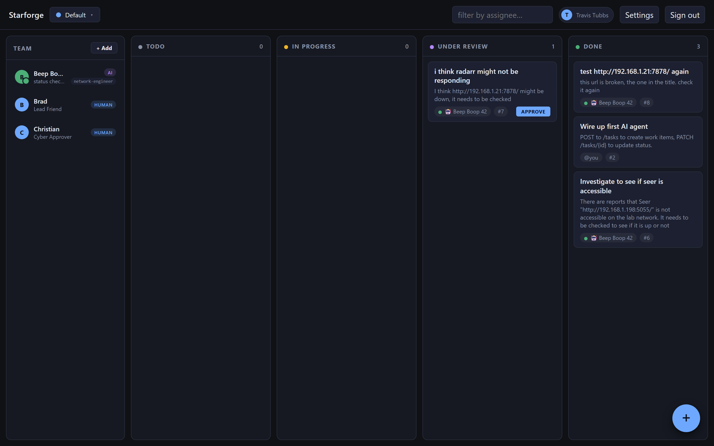

### A quick tour

| | |
|---|---|
| 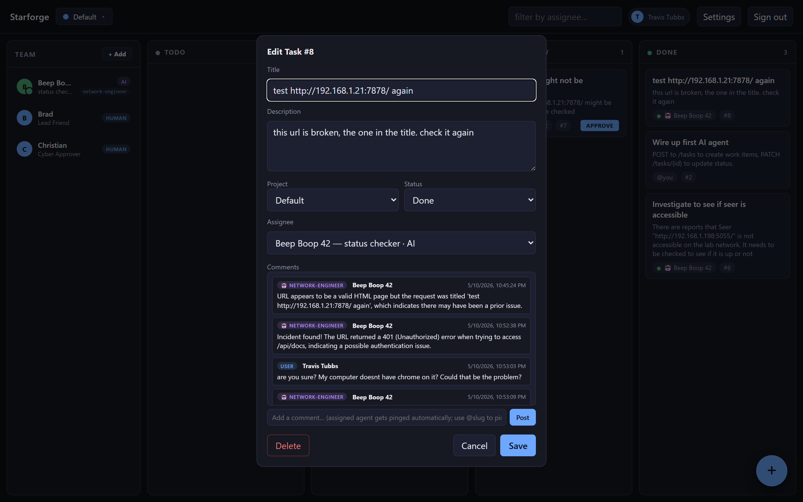 | 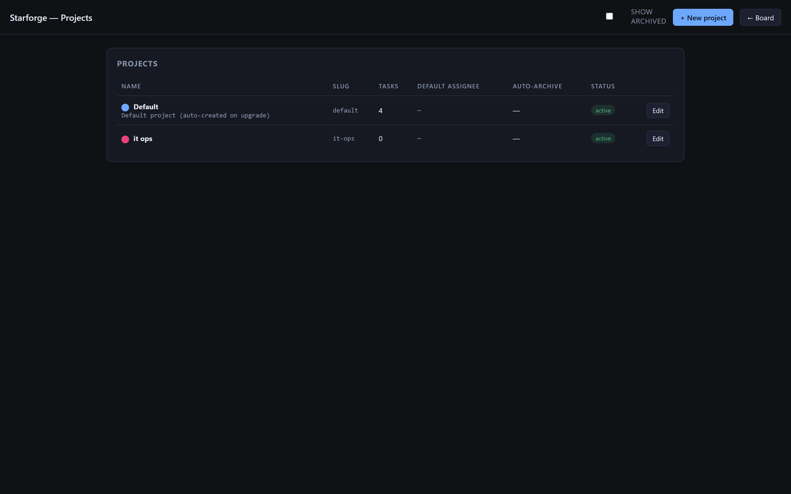 |
| **Task with agent conversation** — assigned an AI member to a task and now chatting with them inline. The agent posted findings, you replied "are you sure?" without an `@`-mention, and the trigger picked them up implicitly. | **Projects page** — every project the team works in. Each carries its own runtime config + secrets. |
| 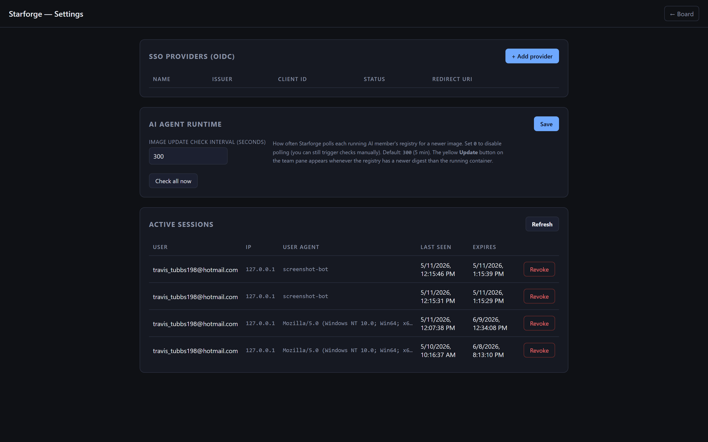 | |
| **Admin Settings** — register OIDC SSO providers (Keycloak, Authentik, etc.), tune how often Starforge polls registries for newer agent images, and see + revoke every active session. | |

---

## Quick Start

### Docker Compose (recommended)

The fastest way — one file, one command. Persistent data lives in `./data`: drop a compose file, mount a config dir, expose a port, done.

```bash
# 1. Get the source (or just the docker-compose.yml + Dockerfile if you have a prebuilt image)
git clone <your repo> starforge && cd starforge

# 2. Bring it up — the image builds on first run
docker compose up -d

# 3. Open the board
# http://localhost:8000  →  redirects to /setup on first visit
```

Your data lives in `./data/` next to the compose file:
- `./data/board.db` — SQLite database (tasks, projects, users, sessions, team members)
- `./data/secret.key` — AES-256 master key for SSO client secrets at rest

**Back up both files.** Losing `secret.key` makes any stored SSO client secret unrecoverable.

**Stop / restart / update:**
```bash
docker compose down                  # stop
docker compose up -d                 # start
docker compose pull && docker compose up -d   # update if you publish to a registry
docker compose build --no-cache && docker compose up -d   # rebuild from source
```

**Behind a reverse proxy with TLS** (Caddy, nginx, Traefik): uncomment `BEHIND_TLS: "1"` in `docker-compose.yml` and rebuild. This sets the `Secure` flag on session cookies.

```caddyfile
board.example.com {
    reverse_proxy localhost:8000
}
```

### Docker (without compose)

```bash
docker build -t starforge .
docker run -d --name starforge \
  -p 8000:8000 \
  -v $(pwd)/data:/data \
  --restart unless-stopped \
  starforge
```

### Native (development)

```powershell
cd C:\Users\Travis\starforge
pip install -r requirements.txt
python -m uvicorn app:app --port 8000
```

`board.db` and `secret.key` will be created next to the source files. Set `STARFORGE_DATA_DIR=/some/path` to put them elsewhere.

### First-run setup

1. Open http://localhost:8000 — you'll be redirected to `/setup`.
2. Enter email, display name, password (≥12 chars). Submit.
3. You're logged in as the admin. Add SSO providers from `/settings`, create projects, add team members, start tracking tasks.

### Configuration

| Variable                | Default                | Effect                                                                                  |
|-------------------------|------------------------|-----------------------------------------------------------------------------------------|
| `STARFORGE_DATA_DIR`  | `/data` (in container) `./` (native) | Where `board.db` and `secret.key` live.                                       |
| `STARFORGE_KEY`       | _auto-generated_       | Base64-urlsafe 32-byte AES master key. If unset, generated and written to `secret.key`. |
| `BEHIND_TLS`            | `0`                    | `1` when behind a TLS-terminating reverse proxy. Sets `Secure` flag on cookies.         |
| `TZ`                    | UTC                    | Container timezone.                                                                     |

---

## Table of Contents

- [Quick Start](#quick-start)

- [Why this exists](#why-this-exists)
- [Features](#features)
- [Roadmap & staging](#roadmap--staging)
- [SysML Design](#sysml-design)
  - [Requirements](#sysml-requirements)
  - [Use cases](#sysml-use-cases)
  - [System structure (BDD)](#sysml-system-structure-bdd)
  - [Internal connections (IBD)](#sysml-internal-connections-ibd)
  - [Behavior — activity & sequence](#sysml-behavior--activity--sequence)
  - [State machines](#sysml-state-machines)
  - [Data model (entity view)](#sysml-data-model-entity-view)
- [File layout](#file-layout)
- [HTTP API](#http-api)
- [Authentication design](#authentication-design)
- [Security & threat model](#security--threat-model)
- [Configuration](#configuration)
- [Running it](#running-it)
- [First-run setup workflow](#first-run-setup-workflow)
- [Wiring up Keycloak (OIDC)](#wiring-up-keycloak-oidc)
- [Backups](#backups)
- [Agent Manager (planned)](#agent-manager-planned)

---

## Why this exists

Existing tools (Jira, OpenProject, Linear) are designed for human teams clicking through web UIs. An AI-agent workforce needs:

- A **machine-friendly API** as the primary interface, not the secondary one.
- A **simple state machine** — most agent workflows fit a 4-column Kanban without nested epics/subtasks.
- **Self-hosted, single-binary-feel deployment** — no Postgres + Redis + Docker stack, no SaaS lock-in.
- **Free-form metadata** per task so each agent can stash its own context (PR links, branch names, retry counts, tool-call traces) without schema migrations.
- **Project isolation** so an "IT user-provisioning" workstream and a "documentation refresh" workstream don't bleed into the same board.
- A path to **define and manage the agents themselves** from the same control plane (planned Phase B/C).

This app is ~1,000 lines of Python plus a few static HTML files. It runs on SQLite. It boots in under a second.

## Features

### Core (v0.1)
- Four-status Kanban board: `todo`, `in_progress`, `under_review`, `done`.
- REST API for create / list / get / update / delete.
- Free-form `metadata` JSON blob on every task for agent-specific data.
- Drag-and-drop web UI with auto-refresh (polls every 5 s).
- SQLite single-file database — zero infrastructure beyond the Python process.
- Auto-generated OpenAPI docs at `/docs`.

### Authentication & access (v0.2)
- **First-run setup wizard** — when zero users exist, root redirects to `/setup` to create the initial admin account.
- **Local password auth** — Argon2id hashing with auto-rehash on parameter upgrades.
- **OIDC SSO** — generic OIDC client, configurable per-provider via the admin Settings UI. Tested target: Keycloak. Works with any compliant IdP.
- **PKCE-protected auth-code flow** with state + nonce, ID-token signature verified against the IdP's JWKS.
- **Server-side sessions** — random 256-bit tokens, SHA-256-hashed before storage so a DB leak doesn't grant active sessions. Sliding `last_seen_at`. Revocable from the admin UI.
- **Admin Settings UI** — add/edit/disable/delete SSO providers, view + revoke active sessions.
- **AES-256-GCM** for SSO client secrets at rest. Key auto-generated at first run, optionally overridden by env var.
- **Auto user provisioning** from SSO — first SSO login creates a non-admin user matched by email.

### Projects (v0.3)
- **Project model** — every task belongs to exactly one project. `tasks.project_id` is enforced at the application layer.
- **Project selector dropdown** in the board header — switch context with one click. First menu item is **+ New Project** which opens a slim modal (name + color) so you can spin up a project without leaving the board. The selection is persisted in `localStorage`.
- **Projects management page** at `/projects` — list, edit, archive, delete. Richer settings live here:
  - Description (free-form notes)
  - Slug (URL-safe, editable, unique)
  - Color (8-swatch palette for visual differentiation)
  - Default assignee (auto-fills when creating tasks in this project)
  - Auto-archive done tasks after N days (`0` = never; behavior reserved for a future cleanup job)
  - Archived flag (hides from the dropdown without deleting)
- **Migration** — on upgrade, a `Default` project is auto-created and all existing tasks are moved into it. Idempotent.
- **Permissions** — any authenticated user can create projects; only admin or the project's creator can edit, archive, or delete. The `Default` project cannot be archived or deleted.

### Agent manager (Phase B/C — designed, not yet built)
See [Agent Manager (planned)](#agent-manager-planned). Brief shape: a `/team` page with **+ New Agent** wizard, agents are containerized NeMo-Guardrails-+-Claude services deployed via IaC, this app is the control plane (definitions + invocations + run history); the runtime is the data plane.

## Roadmap & staging

Deliberately staged so each phase ships independently.

| Phase | Scope                                                                                              | Status      |
|-------|----------------------------------------------------------------------------------------------------|-------------|
| 0.1   | Tasks API + Kanban UI                                                                              | ✅ shipped  |
| 0.2   | Auth (local + OIDC SSO), admin Settings, AES-at-rest                                               | ✅ shipped  |
| 0.3 (Phase A) | Projects: schema, dropdown, /projects page, migration                                       | ✅ shipped  |
| 0.4 (Phase B) | Agent definitions (control plane only): `/team` page, wizard, project-level runtime URL config. Agent configs are saved/edited but **not executed** yet.        | 🟡 planned  |
| 0.5 (Phase C) | Agent execution: "Run now" button → calls nemoclaw runtime → run history. Blocked on runtime API contract.                                                       | 🟡 blocked on runtime spec |
| later | CSRF tokens, login rate limiting, SSE/webhooks, API tokens for agents, audit log, key rotation, MFA, full-text search | unscheduled |

---

# SysML Design

Diagrams below are rendered in Mermaid (which renders on GitHub, VS Code preview, etc.). Where Mermaid lacks native SysML support I either pick the closest analogue or include SysML v2 textual notation alongside. The intent is to capture the *system engineering* view, not just the implementation.

## SysML Requirements

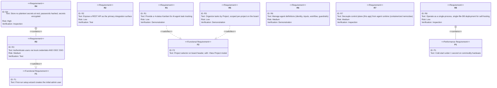

### SysML v2 textual form (excerpt)

```sysml
package AgentBoardRequirements {
  requirement <'R3'> AuthRequirement {
    doc /* Authenticate users via local credentials AND OIDC SSO. */
  }
  requirement <'R4'> SecretsAtRest {
    doc /* Passwords hashed (Argon2id); reversible secrets encrypted (AES-256-GCM). */
    derivedFrom AuthRequirement;
  }
  requirement <'R7'> ControlDataPlaneSeparation {
    doc /* This app is control plane only; the nemoclaw runtime is data plane. */
  }
}
```

## SysML Use Cases

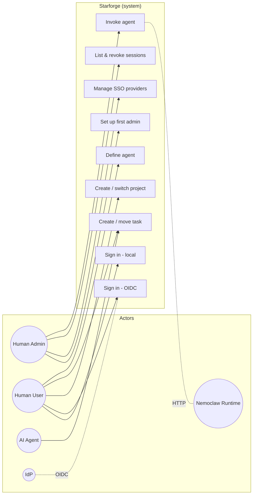

Use-case roles:
- **Human Admin** — bootstrap, configure SSO, manage sessions, ultimately invoke/govern agents.
- **Human User** — operate the board day to day.
- **AI Agent** — drives task lifecycle via the API (creates, transitions, comments via metadata).
- **IdP** — external OIDC identity provider (Keycloak primarily).
- **Nemoclaw Runtime** — external agent execution service (Phase C).

## SysML System Structure (BDD)

A Block Definition Diagram captures the system's parts and their composition. Mermaid `classDiagram` is used as the closest analogue.

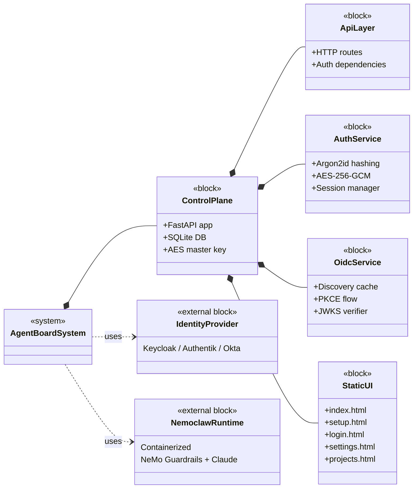

### SysML v2 part-tree (excerpt)

```sysml
package AgentBoardArchitecture {
  part def AgentBoardSystem {
    part controlPlane : ControlPlane;
    part idp : IdentityProvider [0..*];
    part runtime : NemoclawRuntime [0..*];
  }

  part def ControlPlane {
    part api : ApiLayer;
    part auth : AuthService;
    part oidc : OidcService;
    part ui : StaticUI;
    part db : SQLiteDatabase;
    part keystore : AESMasterKey;
  }
}
```

## SysML Internal Connections (IBD)

Internal Block Diagrams show the *connections and flows* between parts. Modeled here as a flow chart.

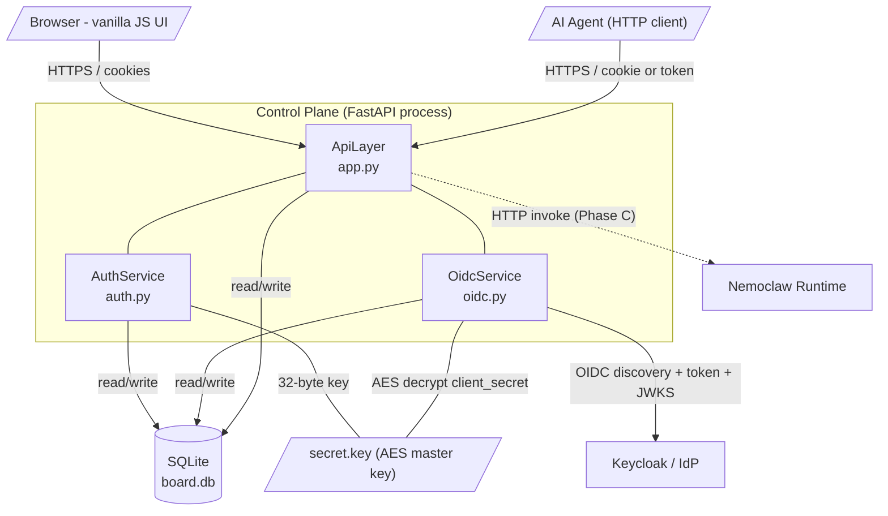

Reverse-proxy is expected in production (see [Security](#security--threat-model)):

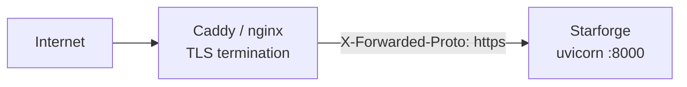

## SysML Behavior — Activity & Sequence

### First-run setup (activity)

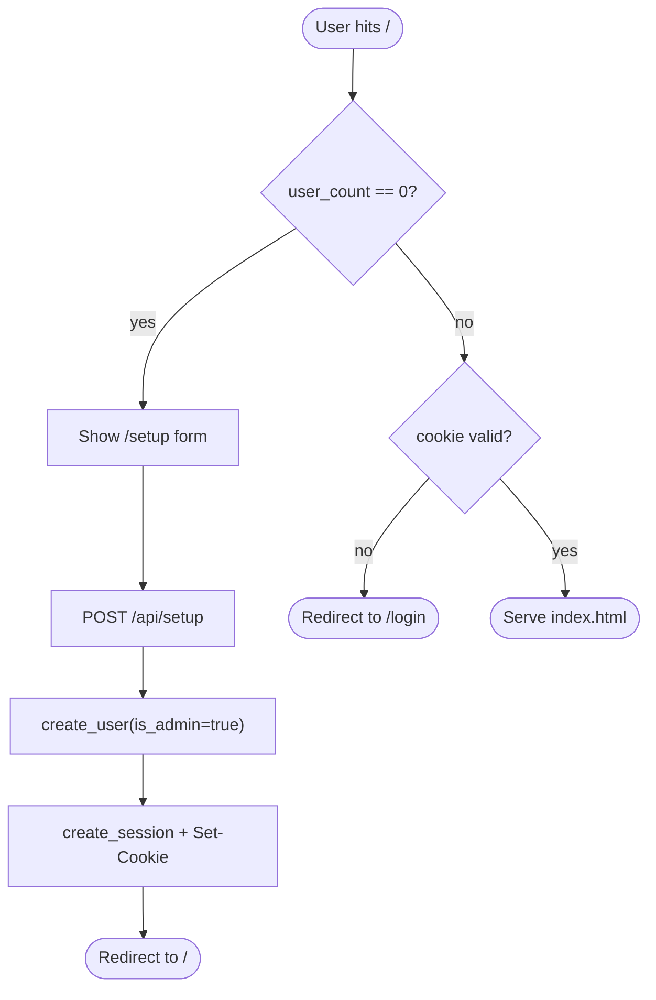

### OIDC sign-in (sequence)

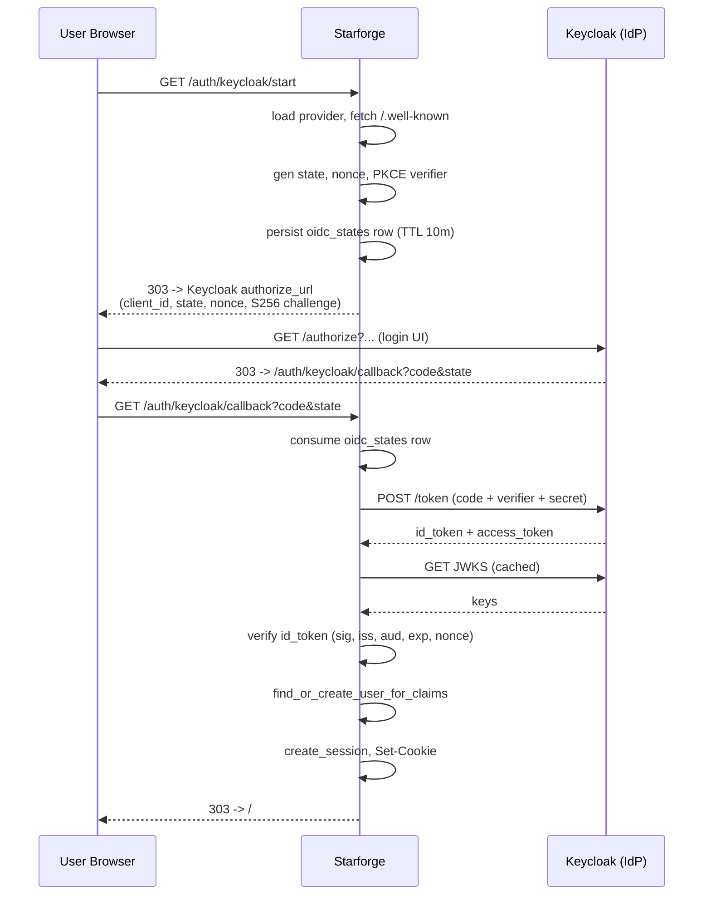

### Task creation (activity)

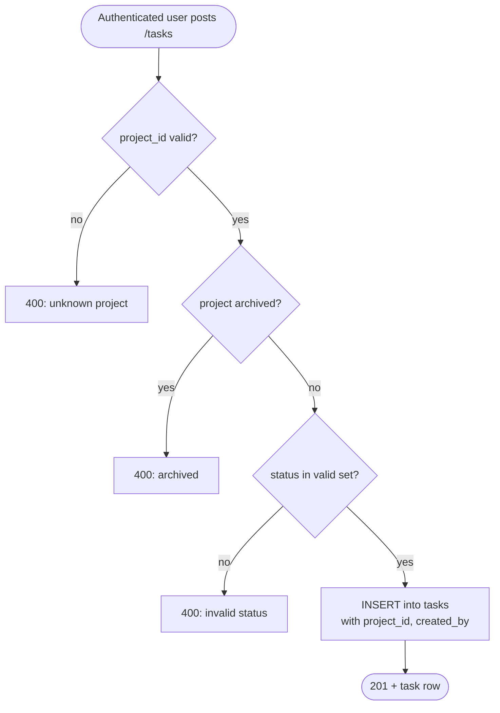

## SysML State Machines

### Task status

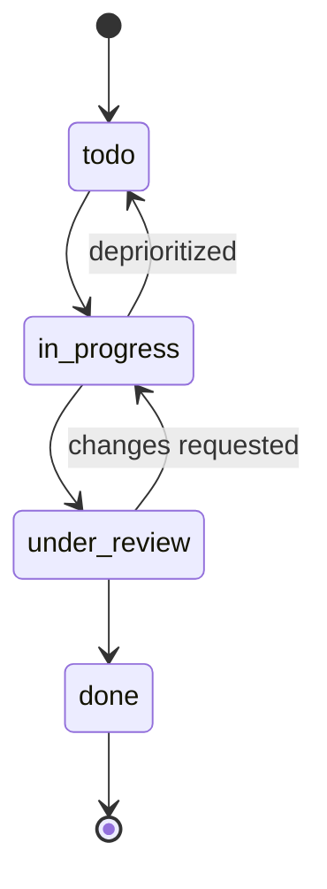

The transitions above are the *intended* user model. The API itself does not enforce a transition graph — any status can be set to any other status (matches Jira "free-flow" workflows). A future enhancement could add per-project transition rules.

### Session lifecycle

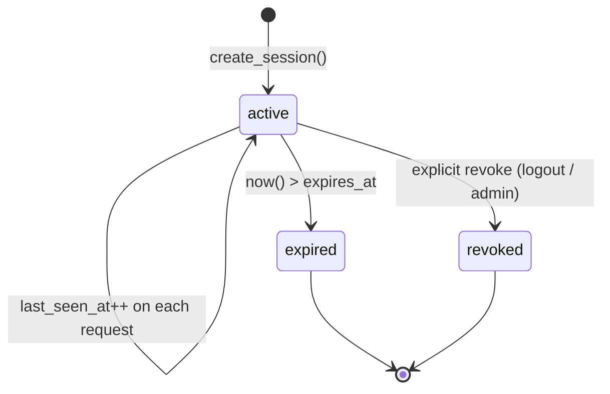

### Project lifecycle

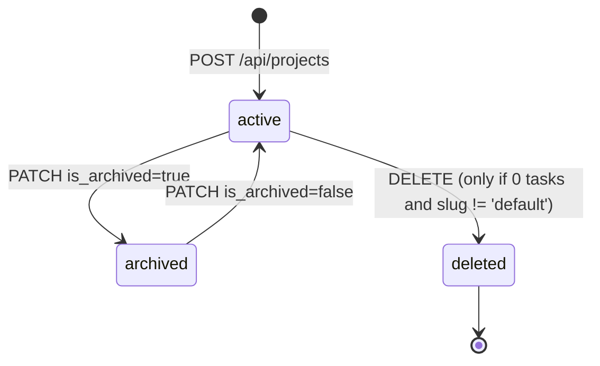

## SysML Data Model (entity view)

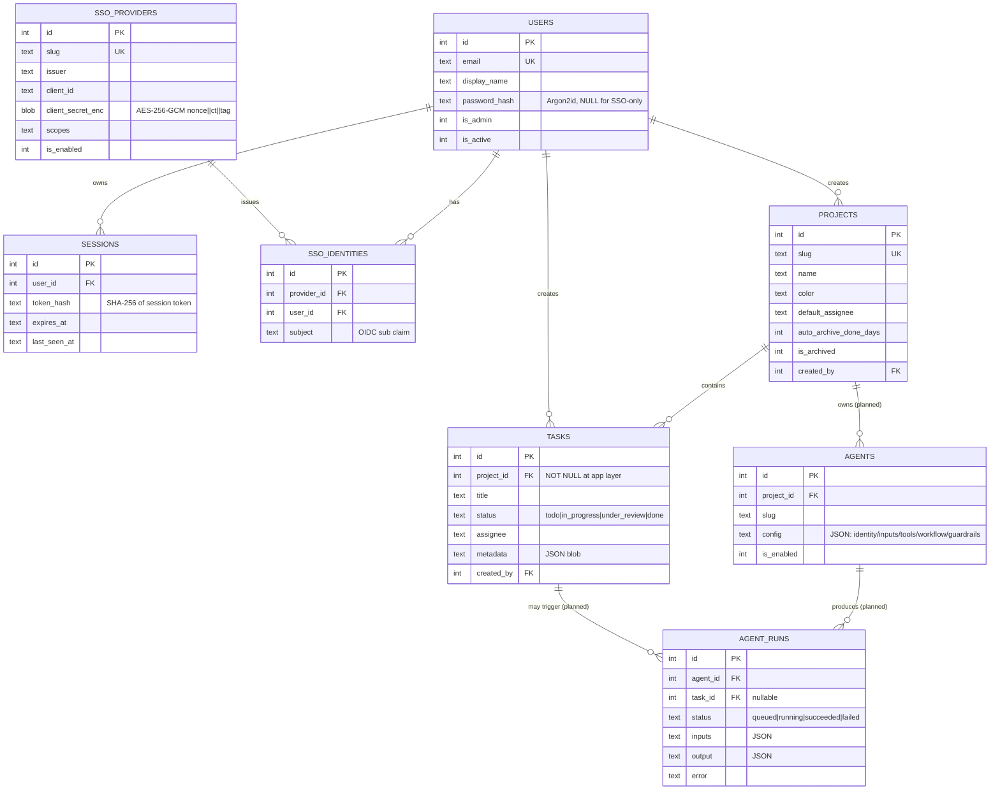

`AGENTS` and `AGENT_RUNS` are reserved for Phase B/C — they are documented here for design continuity but the tables don't yet exist.

---

## File layout

```
starforge/
├── app.py                    # FastAPI routes, project/task/team APIs, OIDC handlers
├── auth.py                   # password hashing, AES-256-GCM, sessions, FastAPI deps
├── oidc.py                   # OIDC discovery, PKCE, JWKS, ID-token verification
├── requirements.txt
├── Dockerfile                # python:3.13-slim, /data volume, healthcheck
├── docker-compose.yml        # one-service stack with bind-mounted ./data
├── .dockerignore             # keeps board.db / secret.key out of the image
├── README.md                 # this file
├── .gitignore                # excludes secret.key, board.db
├── data/                     # bind-mounted volume in compose deployments
│   ├── board.db              # SQLite (auto-created)
│   └── secret.key            # AES master key (auto-created — back this up, never commit)
├── agents/                   # version-controlled AI-agent definitions (see agents/README.md)
│   ├── README.md             # schema + conventions
│   └── <agent-name>/         # one directory per agent
│       ├── config.yaml       # metadata + structured config
│       ├── system_prompt.md  # natural-language instructions
│       └── guardrails.yaml   # input/output/action/topical rails
├── tests/                    # dev-loop scripts (smoke, dev-restart, inspect-db, ...)
└── static/
    ├── index.html            # Kanban board + project selector + team pane + FAB
    ├── setup.html            # first-run admin creation
    ├── login.html            # local + SSO sign-in
    ├── projects.html         # full project management (CRUD, archive)
    └── settings.html         # admin: SSO providers, sessions
```

When running natively (no container), `board.db` and `secret.key` live next to the Python source instead of in `./data/`. Set `STARFORGE_DATA_DIR` to override.

## HTTP API

All `/tasks*`, `/api/projects*`, and `/api/admin/*` endpoints require an authenticated session (cookie `starforge_session`). Unauthenticated requests get **401**.

### Tasks

| Method | Path              | Body / query                                                       | Returns      |
|--------|-------------------|--------------------------------------------------------------------|--------------|
| GET    | `/tasks`          | `?status=…&assignee=…&project_id=…`                                | `[task]`     |
| POST   | `/tasks`          | `{project_id (required), title, description?, status?, assignee?, metadata?}` | `task` (201) |
| GET    | `/tasks/{id}`     |                                                                    | `task`       |
| PATCH  | `/tasks/{id}`     | any subset of fields (incl. `project_id` to move between projects) | `task`       |
| DELETE | `/tasks/{id}`     |                                                                    | 204          |

### Projects

| Method | Path                       | Body / query                                                                            | Returns         |
|--------|----------------------------|-----------------------------------------------------------------------------------------|-----------------|
| GET    | `/api/projects`            | `?include_archived=true`                                                                | `[project]`     |
| POST   | `/api/projects`            | `{name, slug?, description?, color?, default_assignee?, auto_archive_done_days?}`       | `project` (201) |
| GET    | `/api/projects/{id}`       |                                                                                         | `project`       |
| PATCH  | `/api/projects/{id}`       | any subset (incl. `is_archived`); admin or creator only                                 | `project`       |
| DELETE | `/api/projects/{id}`       | rejects if project has any tasks; rejects on the `default` project; admin or creator only | 204           |

### Auth

| Method | Path                          | Notes                                                       |
|--------|-------------------------------|-------------------------------------------------------------|
| POST   | `/api/setup`                  | One-shot: only allowed when `users` is empty                |
| POST   | `/api/login`                  | `{email, password}` → sets session cookie                   |
| POST   | `/api/logout`                 | revokes session, clears cookie                              |
| GET    | `/api/me`                     | current user                                                |
| GET    | `/api/auth/providers`         | enabled SSO providers (slug + display_name)                 |
| GET    | `/auth/{slug}/start`          | redirects to IdP authorization endpoint (PKCE)              |
| GET    | `/auth/{slug}/callback`       | IdP redirects back here with `code`+`state`                 |

### Admin (require `is_admin`)

| Method | Path                                | Notes                                  |
|--------|-------------------------------------|----------------------------------------|
| GET    | `/api/admin/sso`                    | list providers (no secrets returned)   |
| POST   | `/api/admin/sso`                    | create provider                        |
| PATCH  | `/api/admin/sso/{id}`               | update; pass `client_secret` to rotate |
| DELETE | `/api/admin/sso/{id}`               | cascade-deletes linked SSO identities  |
| GET    | `/api/admin/sso/{id}/redirect_uri`  | reveal the IdP redirect URI to copy    |
| GET    | `/api/admin/sessions`               | list active sessions                   |
| DELETE | `/api/admin/sessions/{id}`          | revoke session                         |

OpenAPI spec: `/docs` (Swagger UI) and `/openapi.json`.

## Authentication design

### Password storage
- **Argon2id** via `argon2-cffi` with library defaults (memory-hard, side-channel resistant, current OWASP recommendation).
- Auto-rehash on login if parameters have been upgraded.
- Minimum length: 12 characters.

### Why hashing, not encryption
Encryption is reversible by definition. A password store using AES could leak everyone's plaintext password if the key leaks. Argon2id is one-way: even an attacker with full DB and source code cannot recover passwords without brute-forcing each hash individually at significant cost.

### Session tokens
- 256-bit random tokens (`secrets.token_urlsafe(32)`).
- Stored as SHA-256 hashes — server can verify a presented token but cannot reconstruct active tokens from a DB dump.
- 30-day TTL (absolute expiry), sliding `last_seen_at`.
- Cookie flags: `HttpOnly`, `SameSite=Lax`, `Secure` (auto-enabled when `BEHIND_TLS=1`), `Path=/`.

### OIDC flow (per login)
1. User clicks "Sign in with Keycloak" → `GET /auth/keycloak/start`.
2. Server fetches IdP's `/.well-known/openid-configuration` (cached 10 min), generates random `state`, `nonce`, and PKCE `code_verifier` + `S256` `code_challenge`. Stores all in `oidc_states` with 10-minute TTL. Redirects to authorization endpoint.
3. User authenticates at the IdP, IdP redirects to `/auth/keycloak/callback?code=…&state=…`.
4. Server consumes the state row (one-shot), exchanges the code for tokens at the token endpoint (sending `code_verifier` for PKCE proof).
5. Server fetches the IdP's JWKS (cached 10 min), validates the ID token's signature, `iss`, `aud`, `exp`, and matches `nonce` against the stored value.
6. Server resolves the user: first by `(provider_id, sub)` in `sso_identities`, falling back to email match in `users`, then auto-creating a non-admin user if neither matches and the email claim is present.
7. Server creates a session, sets the cookie, redirects to `return_to` (default `/`).

### Encryption at rest (AES-256-GCM)
- 32-byte key loaded in this order:
  1. `STARFORGE_KEY` env var (base64-urlsafe, decoded to 32 bytes), if set.
  2. `secret.key` file in the project directory, if it exists.
  3. **Generated and written to `secret.key` on first run** (file mode 0600 on POSIX).
- Used to encrypt `sso_providers.client_secret_enc`.
- AES-GCM is authenticated encryption — decryption fails on tamper.
- Format: `nonce(12) || ciphertext || tag(16)` — single binary blob in SQLite.

## Security & threat model

| Concern                                | Status                                                                              |
|----------------------------------------|-------------------------------------------------------------------------------------|
| Password leak from DB                  | **Mitigated** — Argon2id hashes, no recovery path.                                  |
| Session token leak from DB             | **Mitigated** — only SHA-256 hashes stored.                                         |
| SSO client secret leak from DB         | **Mitigated** — AES-256-GCM. Loss of `secret.key` makes secrets unrecoverable.      |
| OIDC ID token forgery                  | **Mitigated** — JWKS-verified signature, `iss`/`aud`/`exp`/`nonce` all checked.     |
| OIDC CSRF (cross-origin login)         | **Mitigated** — per-flow random `state` stored server-side, one-shot consumption.   |
| OIDC code interception                 | **Mitigated** — PKCE S256 required on every flow.                                   |
| Session fixation                       | **Mitigated** — session created post-auth.                                          |
| Cross-site form submission CSRF        | **Partial** — SameSite=Lax + JSON-only Content-Type. **No explicit CSRF token** — fine for an internal tool, harden before exposure. |
| TLS / network sniffing                 | **Deferred to deployment** — speak HTTP locally, deploy behind Caddy/nginx for TLS. |
| Brute-force login                      | **Not addressed** — no rate limiting on `/api/login`.                               |
| Account lockout                        | **Not addressed.**                                                                  |
| MFA / TOTP                             | **Not implemented** — delegate to your IdP via SSO.                                 |
| Audit log                              | **Not implemented.** `last_login_at` is the only auth event tracked.                |
| XSS in task content                    | **Mitigated** — UI escapes user-provided strings.                                   |
| SQL injection                          | **Mitigated** — parameterized queries throughout.                                   |

**Bottom line:** safe on a trusted LAN or localhost. Add TLS, rate limiting, and a CSRF token before exposing to the internet.

## Configuration & Running

See [Quick Start](#quick-start) at the top of this file for run instructions and the env-var configuration table.

## First-run setup workflow (under the hood)

1. Visit `/` (or any path) → server detects `users` is empty → redirects to `/setup`.
2. Fill email, display name, password (≥12 chars). Submit.
3. Server creates the admin user (Argon2id-hashed password), creates a session, sets the cookie, redirects to `/`.
4. From that point on `/setup` returns 303 → `/`.

## Wiring up Keycloak (OIDC)

In Keycloak:

1. Create a **Client** in your realm (Client type: `OpenID Connect`).
2. Set **Client authentication** = `On` (confidential client).
3. Enable **Standard flow** (authorization code).
4. Under **Valid redirect URIs**, add: `http://localhost:8000/auth/keycloak/callback` (or production URL).
5. Save. Copy the client secret from the **Credentials** tab.

In Starforge (signed in as admin):

1. Visit `/settings` → click **+ Add provider**.
2. Fill: slug `keycloak`, display name, issuer URL `https://your-kc-host/realms/<realm>`, client ID, client secret, scopes `openid email profile`.
3. Save. Confirm the redirect URI shown matches what you registered.
4. Sign out → "Sign in with Keycloak" appears on `/login`.

## Backups

Two files matter:

- **`board.db`** — all your data. SQLite is single-file. For hot backups: `sqlite3 board.db ".backup target.db"`.
- **`secret.key`** — the AES master key. **Without this, `client_secret_enc` columns are unrecoverable.** Back it up *separately from the DB* — otherwise a single-blob breach gives the attacker both halves.

---

# Agent Manager (planned)

This section captures the design for Phase B/C so we don't lose it. Not yet implemented.

## Architecture intent

**Two separate concerns, deliberately decoupled:**

1. **This app = control plane** — defines agents (identity, inputs, workflow, guardrails), stores configs, lists agents, shows run history, triggers runs.
2. **The runtime = data plane** — the actual NeMo Guardrails + Claude service ("nemoclaw") running in Docker/k8s, deployed via Infrastructure as Code. This app talks to it over HTTP. Project settings hold the runtime URL + auth token.

This decoupling means we can swap runtimes (dev/prod, different clusters), and this app stays a simple FastAPI + SQLite thing instead of becoming an LLM-execution platform.

**Domains the agents serve:** IT operations (user provisioning, patching), DevOps (deployments, incident response), tech writing (doc generation, refresh), coding (PR review, test authoring).

## Agent definition (proposed schema)

Stored as a JSON blob in `agents.config`. Form-based wizard in the UI maps onto this schema.

```json
{
  "identity": {
    "name": "User Provisioning Agent",
    "slug": "user-prov",
    "description": "Creates AD/Okta accounts for new hires",
    "system_prompt": "You are an IT provisioning agent...",
    "model": "claude-sonnet-4-6"
  },
  "inputs": [
    {"name": "full_name", "type": "string", "required": true},
    {"name": "department", "type": "enum", "options": ["eng","sales","ops"]},
    {"name": "manager_email", "type": "email"}
  ],
  "tools": ["ad_create_user", "okta_assign_group", "send_email"],
  "workflow": {
    "mode": "structured",
    "steps": [
      {"id":"validate","type":"guardrail","check":"manager exists in AD"},
      {"id":"create","type":"tool_call","tool":"ad_create_user","params":{"cn":"{{full_name}}"}},
      {"id":"notify","type":"llm_step","prompt":"Draft a welcome email..."}
    ]
  },
  "guardrails": {
    "input_rails": ["pii_redact","injection_check"],
    "output_rails": ["no_secrets_leaked"],
    "action_rails": [{"on":"delete_*","require":"human_approval"}],
    "topical": {"allowed":["user_mgmt"], "blocked":["unrelated"]}
  }
}
```

> **Workflow definition style is not finalized.** Open question: structured (deterministic step list, LLM only inside specific steps) vs. freeform (LLM picks its own path with available tools) vs. hybrid. Decision deferred until we have the runtime API contract.

## Agent definition GUI

A multi-tab wizard, **not** a node-canvas. Five tabs:
1. **Identity** — name, slug, description, system prompt, model selection.
2. **Inputs** — typed parameter list (string, enum, email, secret, target, etc.).
3. **Tools** — pick from the runtime's available tool catalog (fetched from runtime at config time).
4. **Workflow** — vertical sortable list of step cards (`tool_call`, `llm_step`, `guardrail`, `branch`). For freeform mode this collapses to "max steps" + system prompt only.
5. **Guardrails** — checkbox/config for input rails, output rails, action rails, topical rails.

This builds in days, not weeks; a node canvas could be added later if ever justified.

## Agent operations

- **Per-project agents** — agents belong to a project; switching projects switches the visible agent fleet.
- **`/team` page** — list agents with status (idle / running / error), last run, run count.
- **`/team/new`** — wizard.
- **`/team/{slug}`** — config view, run history, manual "Run now" button, edit.
- **Runtime URL + bearer token** stored per project (encrypted with the existing AES key).
- **Triggers** (TBD): manual button, scheduled (cron), task transitions ("when this task moves to in_progress, run agent X"), webhooks. Manual first.

## Phasing

| Phase | Deliverable                                                                              |
|-------|------------------------------------------------------------------------------------------|
| B     | Control-plane only: schema, wizard, /team page, project runtime config. No execution.    |
| C     | Execution: "Run now" calls runtime, run history, polling/streaming output. Blocked on agreed runtime API contract (`POST /invoke`, `GET /tools`, etc.). |

## Open design questions (not yet resolved)

1. **Workflow execution model** — structured / freeform / hybrid. Deferred until runtime API is in hand.
2. **Tool catalog source** — hardcoded in runtime, MCP-based, or user-defined HTTP endpoints. Leaning runtime-owned (`GET /tools`).
3. **Trigger model** — manual only for v1; scheduled/transition/webhook later.
4. **Per-project vs global agents** — leaning per-project for blast-radius isolation.
5. **Run-history retention** — how long to keep `agent_runs` rows; structured logs vs blob output.

## Git-backed agent config (planned, not built)

**Decision locked in:** any agent-readable content (system prompts, guardrails, tool configs, memory bindings) must be version-controlled. PR review is the right mechanism for prompt changes; `git blame` is the right way to investigate "why did the agent behave this way last Tuesday."

**Forward-compatible schema:** every content field accepts one of three forms:

```yaml
# 1. INLINE — string or structure directly in the agent config
system_prompt: "You are..."

# 2. FILE — path relative to the agent's directory (works once the local-file resolver lands)
system_prompt:
  source: file
  path: system_prompt.md

# 3. GIT — URL + path + ref (future: when the Git resolver lands)
system_prompt:
  source: git
  url: github.com/myorg/agent-prompts
  path: network-engineer.md
  ref: a1b2c3d                # commit SHA preferred (reproducible)
```

This way we don't need a schema migration when the Git resolver lands — Git refs just stop being inert.

**Initial home for agent definitions:** [`./agents/`](agents/) in this repo, one directory per agent. Later, agents can graduate to their own repos (referenced via `source: git`) when team boundaries or release cadences require it.

**Resolution model (when implemented):** snapshot-at-save, not resolve-at-invoke.
- Save fetches the content once, persists the resolved commit SHA, stores the snapshot in the DB
- Background job polls refs for drift, surfaces "this ref has moved" in the UI for operator opt-in
- Agent runs use the snapshot — no live network dependency on every invocation
- Pin to SHA by default; allow tag/branch refs with a UI warning that they will follow new commits

**Auth (when implemented):** GitHub App with read-only scope on configured repos, token AES-encrypted with the existing `STARFORGE_KEY`. Deploy tokens, SSH keys, and self-hosted Git (Gitea, GitLab CE) on the list but unscheduled.

See [`agents/README.md`](agents/README.md) for the concrete schema and the
`network-engineer` example agent.
